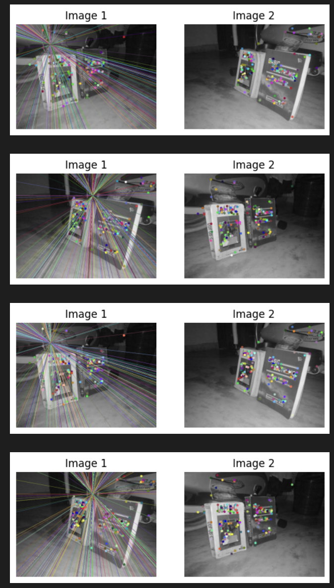
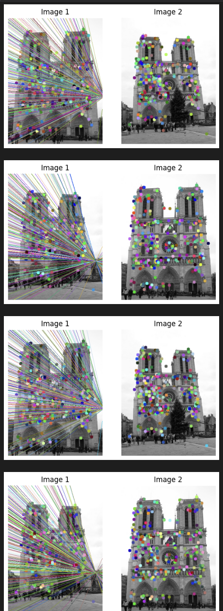
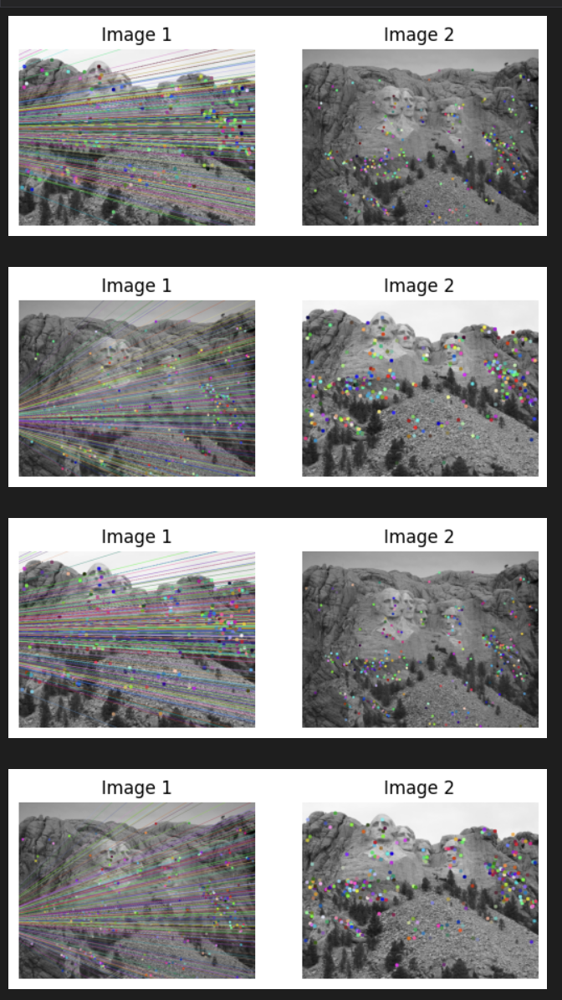
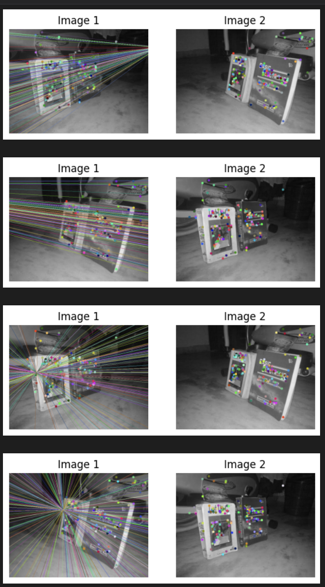
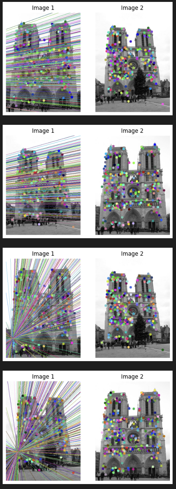
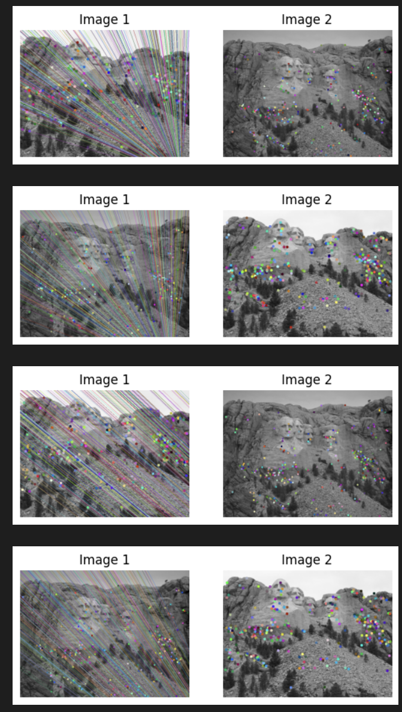

# Eight-Point-RANSAC-Algorithm-
A basic implementation of 8 point and RANSAC algorithm in Python using Numpy and Matplot

## Introduction
This is a basic implementation of the 8 point and RANSAC algorithms. It utilizes epipolar geometry to identify the structure of a 3D scene, given only two images from differing viewpoints

## Data 
The image data used for this project consists of three images sampled from two different viewpoints. They are in the data folder.

## Method
### 8 Point Algorithm
First the points have to be normalized. To do this there are three steps:
  1. Compute the centroid of all the points.
  2. Compute the mean of all distances to the centroid.
  3. Nomralize the centroid to the origin by converting the mean distances from the points to the centroid to √2.

### RANSAC Algorithm
The RANSAC Algorithm considers 8 points randomly and then tests the result with all points but those 8. The steps are:
  1. Sample 8 points at random from the corresponding points.
  2. Compute the normalized fundamental matrix for those 8 points.
  3. Find the number of inliers and outliers with the normalized fundamental matrix.
  4. Repeat steps 1-3 until a certain number of iterations have passed.
  5. Return the fundamental matrix with the most number of inliers i.e. the best fundamental matrix.
  
## Results
The results for the 8 point algorithm are as follows:

The results for the RANSAC algorithm are as follows:

